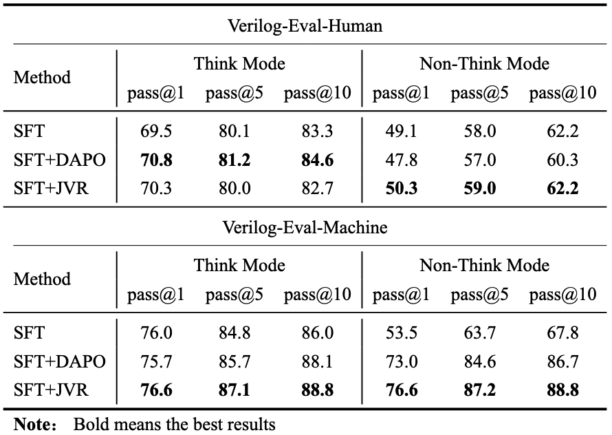
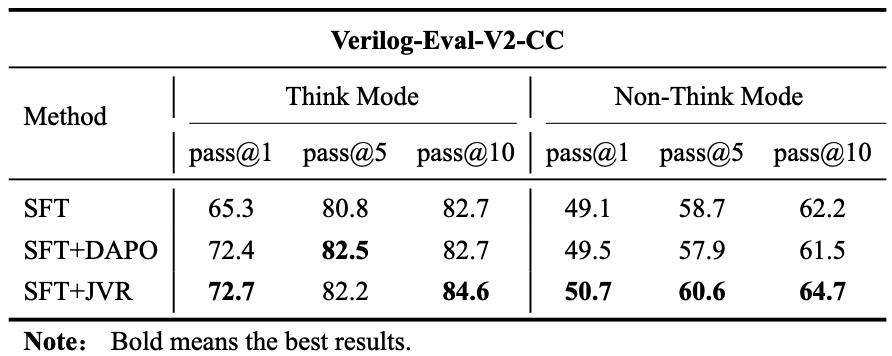
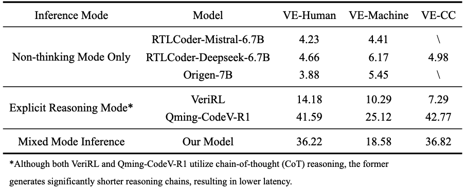

# JVR-Verilog-LLM

## Project Overview

This repository introduces an efficient Verilog generation framework designed to enhance Large Language Models via Joint Verification Rewards (JVR) and Dynamic Switching Mechanisms. It aims to address the limitations of current CoT-dependent models, specifically their restricted accuracy in direct (non-thinking) generation and low inference efficiency.

## Key Highlights

- **Joint Verification Reward (JVR):** A deep reinforcement learning algorithm based on **DAPO** (Decoupled Clip and Dynamic sAmpling Policy Optimization) that assigns additional rewards to samples that pass functional verification in both thinking and non-thinking modes. This implements an implicit knowledge distillation of reasoning capabilities into the fast inference path, effectively improving the quality of code generation in the model's non-thinking mode.
- **Dynamic Switching Mechanism:** An automatic model switching strategy based on output token perplexity. By monitoring preliminary generation results in real-time, the model utilizes perplexity metrics to automatically evaluate logical complexity and dynamically trigger thinking mode switching, achieving an adaptive balance between generation efficiency and hardware logic complexity.

## Evaluation Results

<p align="center">
  
  <br>
  <b>Table 1:</b> <i>Performance by Training Stage on VE-V1 (%)</i>
</p>

<p align="center">
  
  <br>
  <b>Table 2:</b> <i>Performance by Training Stage on VE-V2-CC (%)</i>
</p>

<p align="center">
  
  <br>
  <b>Figure 1:</b> <i>Single-Sample Latency Comparison (s)</i>
</p>

## Quick start

1. JVR Training
To reproduce the Joint Verification Reward (JVR) training process on a dual-GPU setup:
```bash
bash scripts/mydesign_8b_2gpu.sh
```
2. Model Inference
- **Adaptive Inference:** Uses the perplexity-based switching mechanism to balance quality and speed.
```bash
bash scripts/infer_switch.sh
```
- **Original Inference:** Standard inference supporting both pure CoT and non-CoT generation.
```bash
bash scripts/infer_qwen.sh
```

## Requirements & Installation

### Method 1: Using Official Docker (Highly Recommended)
To bypass potential environment conflicts (e.g., GLIBC version mismatches), we strongly recommend using the official `VERL` Docker image:

```bash
sudo docker run -it --runtime=nvidia --gpus all --net=host \
    --shm-size="20g" \
    --cap-add=SYS_ADMIN \
    -v $PWD:/project \
    --name jvr_verilog \
    verlai/verl:vllm012.latest bash
```

### Method 2: Manual Installation

If you prefer to set up the environment manually, please ensure your OS is Ubuntu 22.04 or later.

1. Core Frameworks
- `ms-swift` (3.12.3): Required for Supervised Fine-Tuning (SFT). Please refer to the official SWIFT installation guide.
- `VERL` (0.8.0.dev0): The reinforcement learning pipeline is built on VERL, developed by ByteDance. Please follow the VERL GitHub repository to build and install it from source.
2. Hardware Accelerators
To install transformer-engine, explicitly set the cuDNN paths before pip installation:
```bash
SITE_PACKAGES=$(python -c "import site; print(site.getsitepackages()[0])") && echo $SITE_PACKAGES
CUDNN_PATH=$SITE_PACKAGES/nvidia/cudnn 
CPLUS_INCLUDE_PATH=$SITE_PACKAGES/nvidia/cudnn/include 
pip install git+[https://github.com/NVIDIA/TransformerEngine.git@stable](https://github.com/NVIDIA/TransformerEngine.git@stable)
```
To install flash_attn from source, you can accelerate the build process by increasing the number of parallel jobs:
```bash
MAX_JOBS=64 python -m pip -v install flash-attn --no-build-isolation
```
⚠️ Warning: Compiling flash-attn with MAX_JOBS=64 is highly resource-intensive and may consume up to 500GB of RAM. Please scale down MAX_JOBS (e.g., to 8 or 16) depending on available memory.
3. Troubleshooting: GLIBC Compatibility
If constrained to Ubuntu 20.04, there might be an error during compilation: a version 'GLIBC_2.32' not found. To resolve this, there's a need to manually upgrade glibc. Please refer to these community solutions: [Flash-Attention Issue](https://github.com/Dao-AILab/flash-attention/issues/1762) or [Modular Issue](https://github.com/modular/modular/issues/3684#issuecomment-2480409734).

## Acknowledgments

This project is built upon the foundational work of several outstanding open-source repositories. We would like to express our sincere gratitude to the authors of the following projects:

* **[VERL](https://github.com/volcengine/verl):** Our training pipeline, particularly the custom DAPO implementation and token-level gradient updates, is heavily based on this highly efficient reinforcement learning framework.
* **[Qming-CodeV](https://github.com/iprc-dip/CodeV-R1):** We utilized their meticulously curated Verilog RL datasets, which significantly facilitated our supervised fine-tuning and reinforcement learning processes.

We sincerely thank the researchers and developers for their valuable contributions to the open-source community.
